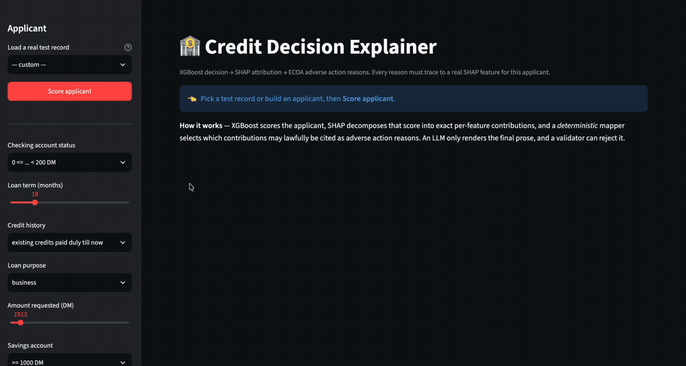

# Credit Decision Explainer

**A credit model that explains its own loan denials — and a checker that catches the AI when it makes an explanation up.**



**Try it live:** [web-production-7b272.up.railway.app](https://web-production-7b272.up.railway.app/health) · [How it's built](docs/architecture.md) · [What went wrong](#what-went-wrong)

---

## Why this exists

If a bank turns you down for a loan, US law (ECOA and FCRA) says they have to tell you *why* — the specific reasons, not vague ones. That letter is called an **adverse action notice**.

The tempting way to build this is: show the model's output to an AI, ask it to write the letter. That fails in a way that's genuinely hard to spot. Language models write fluent, confident, professional-sounding reasons that simply **aren't true of the person being denied**.

Here's the actual failure mode:

> **What the system knew:** `Length of requested credit term: 45 months`
>
> **What the AI wrote:** *"your 45-month term, combined with your **limited employment history** and **recent credit inquiries**..."*

That person's employment history had nothing to do with it. Credit inquiries aren't even something this system tracks. The AI invented two reasons for denying someone credit — in a legal document, and the person receiving it would have no way to know.

**This project makes that impossible by design, instead of just unlikely.**

## How it works

Five steps. The AI is only involved in step four, and step five double-checks it.

| Step | What happens | Who does it |
|---|---|---|
| 1 | Score the applicant — how risky are they? | XGBoost model |
| 2 | Break that score into per-feature contributions | SHAP |
| 3 | **Pick** which contributions can legally be cited | Plain code, no AI |
| 4 | Write those into readable sentences | Gemini |
| 5 | **Check** every sentence against step 3 | Plain code, no AI |

The key idea: **the AI never decides anything.** By the time it runs, the decision is made and the reasons are already chosen. Its only job is wording. If it adds anything that wasn't in the list, step 5 rejects it and the system falls back to plain, blunt, correct text.

Most projects that combine AI with explainability let the model *generate* the reasons. That means nothing downstream can tell a real reason from a convincing invention. Splitting "choose" from "word it" is what makes checking possible at all.

**A note on SHAP:** the model gives one number — "89% likely to default." That's useless for a letter. SHAP splits that number into how much each individual fact pushed it up or down: overdrawn checking account +0.79, loan size +0.81, and so on. Those pushes are what become reasons.

## Results

### Does the model actually predict anything?

| Measure | Result | What it means |
|---|---|---|
| ROC AUC | **0.8046** | 0.5 is coin-flip, 1.0 is perfect |
| Same, across 5 different data splits | **0.8089 ± 0.0220** | range 0.7725 – 0.8399 |
| PR AUC | 0.6827 | vs 0.300 for a useless model |
| Accuracy | 0.7800 | at the 50% cutoff |
| **Catches risky applicants** | **52%** | ← the number that matters |

Two things worth being upfront about:

**Any single number here is unreliable.** On 1,000 rows, just changing which rows land in the test set swings the score by 0.07. So the spread is reported next to the average. A "0.01 improvement" on this dataset is noise, not progress.

**It only catches about half the bad risks.** That's the real weakness. Accuracy of 78% sounds fine until you notice 70% of applicants are good anyway. A lender would care about that 52%, and fixing it means choosing the cutoff based on what a missed default actually costs versus a wrongly-rejected customer — a business decision, not a modelling one.

### Does the explanation layer hold up?

| Check | Result |
|---|---|
| SHAP math verified correct | **200 / 200 applicants** |
| Every feature has a decision about it | **17 / 17** |
| Features blocked as never-citable | 7 |
| Denials with no reason given | **0 / 46** |
| **Reasons citing something that wasn't a factor** | **0** |
| **Reasons citing something that helped the applicant** | **0** |
| Same input, same output every time | yes |

Those last two zeros are the point of the whole project.

### Does it work end to end, with the AI?

Across 10 test cases (5 designed to trip it up), using Gemini 3.6 Flash:

| Measure | Result |
|---|---|
| **Cases where every reason was legitimate** | **10 / 10** |
| Times the checker rejected the AI | 0 / 10 |
| Times it fell back to plain text | 0 / 10 |
| **Reasons lost when the AI merged two bullets** | **1 of 8 denials** |
| Speed (typical / worst) | **13s / 34s** |
| Two AI-judged quality scores | **couldn't measure — hit free-tier limit** |

The hardest test case passed: an applicant where the biggest legitimate-looking factor is one we deliberately block, and the AI never sneaked it back in.

### Four honest caveats on that 10/10

**1. The checker has never actually caught a real lie.** It's been tested against 12 fake bad inputs that I wrote by hand, and it caught all of them. But across 10 real runs the AI behaved itself, so the rejection path never fired for real. That's evidence the AI behaved — not proof the checker works when it counts.

**2. The checker only knows about things that exist.** It spots the AI misusing a real feature. It does *not* spot the AI inventing something from scratch. I tested 8 made-up phrases: it caught "employment history", "job type", and "housing situation", but missed **"recent credit inquiries", "bankruptcy filing", "collection account", "debt-to-income ratio"**, and **"payment history"** — which are exactly the phrases an AI would reach for. **This is the biggest known hole.**

**3. Nothing checks for reasons going missing.** In one case the system picked 4 reasons and the AI wrote 3, quietly merging two that shared similar wording. Everything it printed was true — one just vanished. Legally, dropping a real reason is arguably worse than adding a fake one, and the traceability score still came out a perfect 1.00.

**4. Two of the three quality metrics never ran.** Google's free tier allows 20 AI requests, and one run burns that almost immediately. Both metrics are wired correctly — they fail on billing, not on code.

That failed run taught me something anyway. With the extra metrics running, **5 of 8 cases fell back to plain text.** That looks alarming — like the checker rejected most of the AI's work. It didn't. Google was rate-limiting us. Right now the system can't tell "the safety net caught a lie" apart from "the API is throttled," which is a real gap in the logging. The clean 0% above comes from the un-throttled run.

**It's also too slow for real use.** 34 seconds at worst, and almost all of that is waiting on the AI — the non-AI parts take about 30 milliseconds. A real deployment would send the plain-text notice immediately and improve the wording in the background.

## Decisions I made, and what I rejected

**1. Threw away three pieces of data on purpose.** The dataset includes sex, age, and nationality. It's illegal to base a credit decision on any of them. I could have used them and just hidden them from the explanation — but then the model would still be deciding on them and I'd only be concealing it. So they're removed before training. It cost nothing: 0.8046 accuracy without them.
*Where this stops short:* it prevents using those facts directly. It doesn't prevent stand-ins — housing or job type may still quietly correlate with them. Catching that needs a proper fairness audit, which I didn't do.

**2. Didn't split categories into separate columns.** The standard trick (one-hot encoding) turns "checking account status" into four separate columns, which then produces four separate explanation values you'd have to glue back together. Keeping them whole means one fact = one explanation = one reason. Accuracy was the same either way — this was purely about keeping explanations readable.

**3. Let plain code choose the reasons, and the AI only word them.** The rejected alternative is what most people build: hand everything to the AI and ask for reasons. It's unverifiable by construction — there's nothing to check the answer against. Separating the two steps is what creates something to check.

**4. Blocked bad reason mappings instead of forcing them.** "Loan purpose" is what you want the money for — it isn't collateral. Labelling it "collateral not sufficient" would read perfectly well and would be a made-up claim. A wrong-but-believable reason is worse than no reason, because the person receiving it can't argue with it. Seven features are blocked entirely.

**5. When in doubt, send the boring version.** If the checker rejects the AI's wording and retries run out, the applicant gets plain, blunt, correct text. Worse writing, same legal accuracy. A credit system that returns nothing because an AI vendor is down isn't a credit system.

## What went wrong

Full log in [NOTES.md](NOTES.md). The ones worth knowing:

### The model wanted to deny people for paying their bills on time

This looked like a bug and wasn't. Applicants marked *"all credits paid back properly"* were being pushed toward **denial**. The data genuinely says so: that group defaulted **57.1%** of the time, versus **17.1%** for people with troubled credit histories. (A known quirk of this dataset — likely who ends up applying in the first place.)

So the maths was right and the reason was unusable. **You cannot send someone a letter saying "you were denied because you have no missed payments."**

This became the central idea of the project: **being able to trace a reason back to real evidence isn't enough — it also has to be a reason you're allowed to give.** The system needs to know the difference between *true* and *citable*, and it now does.

### My own test harness nearly reported a lie that never happened

The tests stored each applicant's top 6 factors as the source of truth. But because 7 features are blocked, the system sometimes reaches down to the 8th to fill four slots. Four applicants would have had a perfectly honest reason flagged as fabricated.

This is the worst kind of testing bug — not one that misses a problem, but one that **invents** one. And the obvious response, loosening the standard from 100%, would have destroyed the project's core guarantee to fix something that was never broken.

### A safety feature hid a completely dead component

The API is built to keep working if the reason system is unavailable — it reports the status and carries on. Correct for production. But during development a typo made that component unloadable, and the API kept serving happily. A totally dead pipeline looked like a healthy service.

Failing gracefully is right for users and dangerous for whoever's building it.

### Small things that cost real time

- **Three package versions I typed from memory were wrong**, one by a whole major version. Generate lockfiles, don't write them.
- **Every AI model name I used had been retired.** Two 404s before finding one that worked — and Google's own "list available models" endpoint listed both dead ones. Only an actual test call tells the truth.
- **The core library wouldn't even load.** XGBoost needs a maths runtime that its Mac installer doesn't include and this machine had no package manager to fetch. The obvious fix sitting on the system was built for the wrong chip. A different library happened to ship the right version, so I borrowed it from there.

## Try it yourself

Against the live service:

```bash
curl -s https://web-production-7b272.up.railway.app/health
```

```bash
curl -s -X POST https://web-production-7b272.up.railway.app/decision -H 'Content-Type: application/json' -d '{
 "checking_status":"A11","duration_months":45,"credit_history":"A30","purpose":"A49",
 "credit_amount":11816,"savings_status":"A61","employment_since":"A75",
 "installment_rate_pct_income":2,"other_debtors":"A101","residence_since_years":4,
 "property_magnitude":"A123","other_installment_plans":"A143","housing":"A151",
 "existing_credits_count":2,"job":"A173","num_dependents":1,"telephone":"A191"}'
```

You'll get back `DECLINE`, a 93.53% risk score, and four reasons — each one carrying the exact feature and number that justifies it.

Or run it locally:

```bash
git clone https://github.com/ajinkyawadaskar/credit-decision-explainer
cd credit-decision-explainer
uv venv --python 3.11 && uv pip install -r requirements.txt
cp .env.example .env        # add your Google API key
```

```bash
.venv/bin/python src/model.py            # trains, prints real accuracy
.venv/bin/python src/shap_explainer.py   # one worked example
.venv/bin/streamlit run app.py           # the visual demo above
```

## Built with

Python 3.11 · XGBoost · SHAP · FastAPI · LangGraph · Gemini 3.6 Flash · DeepEval · Streamlit · Railway

Data: [UCI German Credit](https://archive.ics.uci.edu/dataset/144/statlog+german+credit+data) — 1,000 real loan applications, 20 facts each, 17 used.
