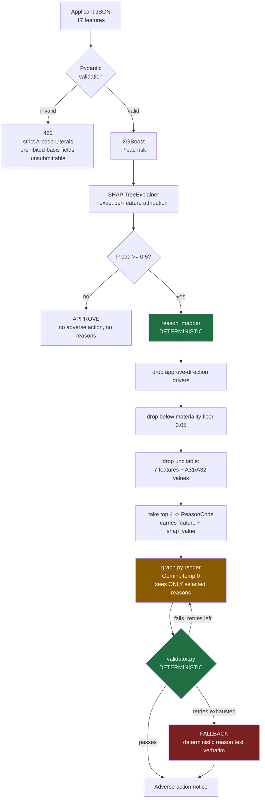

# Architecture

## Request path



**Green = deterministic. Orange = stochastic. The orange node is wrapped on both sides.**

## Why this ordering

The LLM never decides anything. By the time it runs:

- the decision is made (`model.py`)
- the drivers are computed (`shap_explainer.py`)
- the reasons are **selected** (`reason_mapper.py`, pure function)

Its only job is rendering already-chosen reasons into prose, and a deterministic
validator can reject that prose. Most "LLM + explainability" projects let the
model generate the reasons — which means nothing downstream can distinguish a
real reason from a fluent invention.

```
decide -> attribute -> SELECT (deterministic) -> render (LLM) -> VERIFY (deterministic)
```

## Where the guarantee could break, and what holds it

| Failure | Guard |
|---|---|
| Model trained on a prohibited basis | Dropped in `data.py` before training |
| Prohibited basis submitted via API | Absent from schema; `extra="forbid"` -> 422 |
| Prohibited basis reaches the mapper | `assert` in `is_citable()` (defence in depth) |
| Reason cites a feature with no SHAP support | `reason_mapper` builds only from real contributions |
| Reason cites a feature that argued for approval | `direction != toward_decline` filter |
| Reason is true but unlawful to cite | `_UNCITABLE_VALUES` (the A31 case) |
| **LLM invents a reason while writing prose** | **`validator.py` — the reason this project exists** |
| LLM unavailable or repeatedly invalid | Fallback to deterministic text |

## Module ownership

| Module | Purpose | Author |
|---|---|---|
| `data.py` | Load, drop prohibited bases, type, split | Claude |
| `model.py` | XGBoost train/eval/persist | Claude |
| `shap_explainer.py` | TreeSHAP attribution + additivity check | Claude |
| `schemas.py`, `api.py` | Pydantic models, FastAPI service | Claude |
| `evals/dataset.py` | Grounded eval case generation | Claude |
| **`reason_mapper.py`** | **SHAP -> ECOA reason codes** | **Ajinkya** |
| **`validator.py`** | **Traceability enforcement** | **Ajinkya** |
| **`graph.py`** | **LangGraph node wiring** | **Ajinkya** |
| **`evals/metrics.py`** | **Custom DeepEval metrics** | **Ajinkya** |

The four interpretive modules — the ones carrying every judgment call a
reviewer would question — were written by hand, deliberately.
