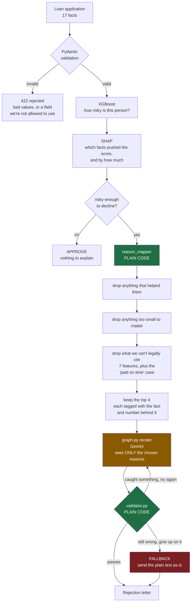

# Architecture

## Request path



Green is plain code that does the same thing every time. Orange is the LLM, the
only part that can surprise you. Note that it's sandwiched: something green
picks what goes in, and something green checks what comes out.

## Why the order matters

The LLM never decides anything. By the time it runs, three things are already
settled: the decision itself (`model.py`), which facts pushed it that way
(`shap_explainer.py`), and which of those facts we're allowed to cite
(`reason_mapper.py`). All of that is plain code with no AI in it.

So the LLM's only job is turning a fixed list into sentences. And because the
list is fixed, there's something concrete to check its output against.

```
decide -> explain -> pick the reasons -> write them up -> check them
                     (plain code)         (LLM)          (plain code)
```

That's the bit most projects skip. If you let the model come up with the
reasons itself, nothing downstream can tell a real reason from a convincing
made-up one. There's no list to compare against. Separating "pick" from "write"
is the only reason checking works at all.

## Where this could go wrong, and what stops it

| What could happen | What stops it |
|---|---|
| Model trained on something it's illegal to use | Those columns are deleted in `data.py` before training |
| Someone sends one of them to the API anyway | Not in the schema, request gets a 422 |
| One slips through to the reason mapper | An assert that should never fire, but is there anyway |
| A reason cites a fact that wasn't a factor | The mapper only builds reasons from real SHAP contributions |
| A reason cites a fact that actually helped them | Anything pointing toward approval is filtered out first |
| A reason is true but not legal to say | The blocklist, which is where the "paid on time" case gets caught |
| **The LLM invents something while writing** | **`validator.py`, which is why this project exists** |
| Gemini is down, throttled, or keeps failing | Falls back to plain text and carries on |

The first three are the same rule enforced in three separate places. That's on
purpose — if the whole point of the project is that reasons have to be
traceable, then the one thing that must never happen is citing a protected
characteristic. Worth over-engineering.

## Who wrote what

I used AI assistance for the scaffolding on this project, and I want to be
straight about where the line was, because I drew it on purpose before I
started rather than after.

**These four files I wrote by hand, deliberately:**

| File | What it decides |
|---|---|
| `reason_mapper.py` | Which SHAP factors are legally allowed to become reasons |
| `validator.py` | Whether the LLM's wording can be trusted |
| `graph.py` | How the retry and fallback path behaves when it can't |
| `evals/metrics.py` | What counts as a reason being traceable at all |

Every judgment call in this system lives in those four. Should a factor that's
mathematically real but legally uncitable be suppressed, remapped, or should it
stop the whole decision? Is the traceability bar 100% or something softer? When
the checker rejects the LLM, does the applicant get plain text or an error?
Those are the questions someone would reasonably grill me on, so I wanted to
have made them myself.

**The rest is plumbing:** loading and cleaning the data, training the model,
setting up SHAP, the FastAPI layer, Pydantic schemas, the Streamlit page,
deploy config, the eval case generator. Real work, but nothing in it is a
decision I'd need to defend. I used help there and it saved me most of a day.

Being able to explain something under follow-up questions is worth more than
having typed it. Splitting the work this way is what made the first part
possible.
